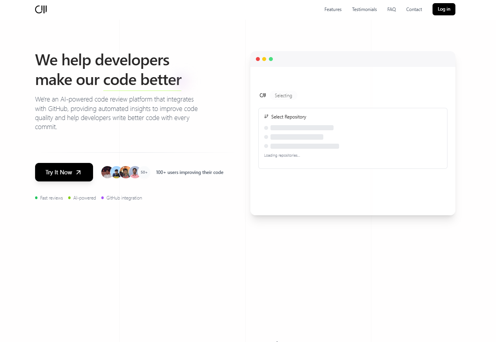
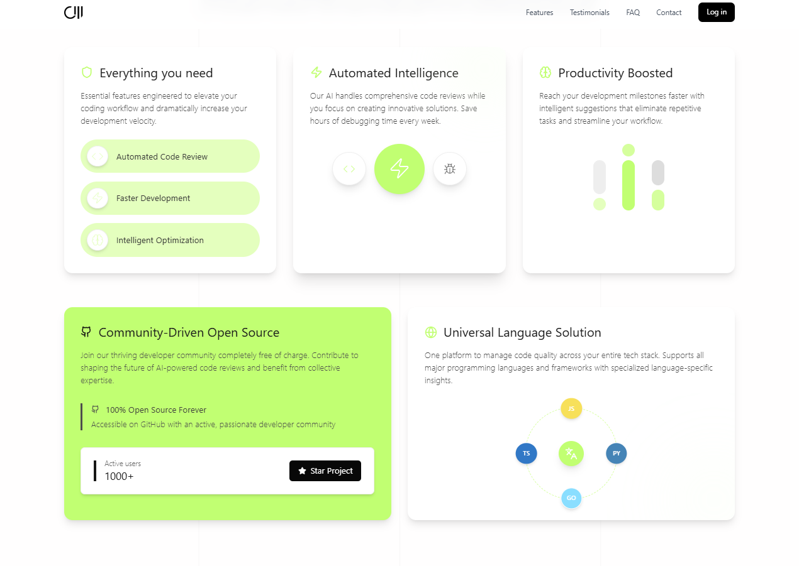
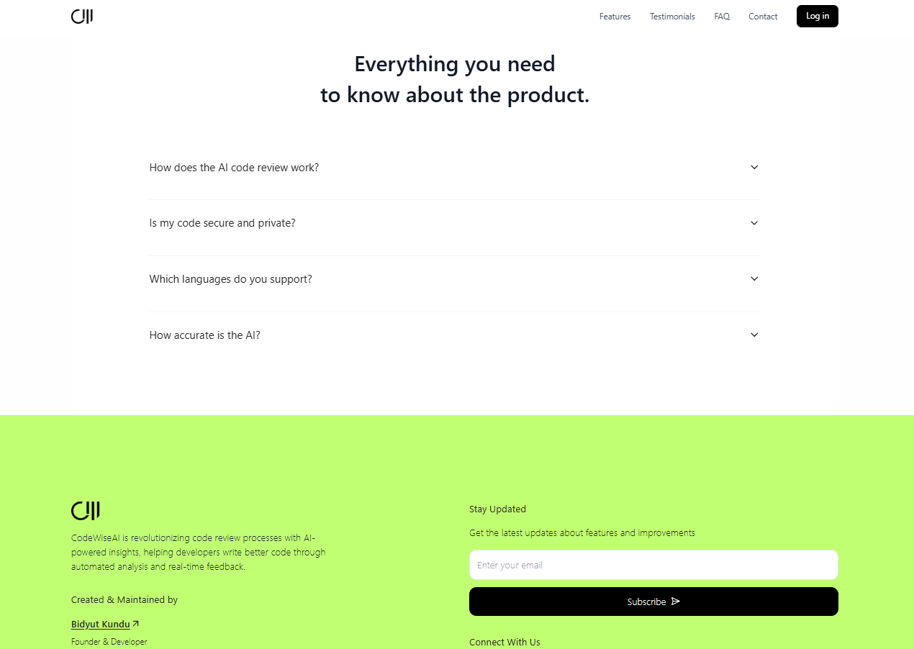
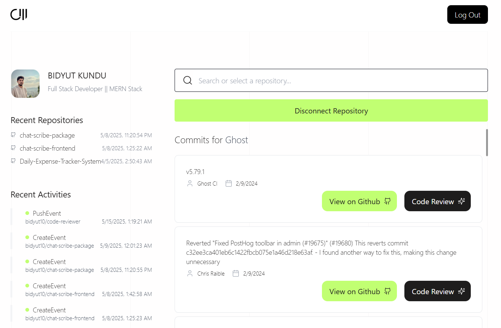

# CodeWise AI Documentation







## Table of Contents
1. [Introduction](#introduction)
2. [Features](#features)
3. [Technical Architecture](#technical-architecture)
4. [Installation & Setup](#installation--setup)
5. [Environment Configuration](#environment-configuration)
6. [API Documentation](#api-documentation)
7. [User Interface Guide](#user-interface-guide)
8. [Authentication Flow](#authentication-flow)
9. [Troubleshooting](#troubleshooting)
10. [Contributing](#contributing)

## Introduction

**CodeWise AI** is an advanced platform designed to streamline GitHub repository management and provide AI-powered code reviews. By connecting with GitHub through secure authentication, users can access their profile information, repositories, and commit histories. The platform's standout feature is its AI-driven code review system that analyzes code across commits, compares changes against best practices, and provides intelligent feedback to improve code quality.

## Features

### 1. GitHub Authentication
- Secure login via GitHub OAuth
- Access to user profile data
- Repository permissions management
- Seamless authentication flow

### 2. Repository Management
- Connect and browse all accessible GitHub repositories
- View detailed repository information
- Monitor repository activity and statistics
- Track commit histories across projects

### 3. Commit Analysis
- Detailed commit history visualization
- File change tracking between commits
- Code diff visualization
- Commit metadata display

### 4. AI-Powered Code Reviews
- Intelligent analysis of code changes
- Automated best practices evaluation
- Code quality suggestions
- Performance optimization recommendations
- Security vulnerability detection
- Coding standards compliance checking

### 5. User Dashboard
- Personalized overview of repositories
- Recent activity tracking
- Quick access to frequently used repositories
- Summary statistics of code quality

## Technical Architecture

CodeWise AI is built using a modern tech stack with a focus on performance, security, and scalability:

### Frontend
- **React**: JavaScript library for building the user interface
- **Tailwind CSS**: Utility-first CSS framework for styling
- **Vite**: Next-generation frontend tooling

### Backend
- **Node.js**: JavaScript runtime for the server
- **Express.js**: Web application framework
- **Passport.js**: Authentication middleware
- **MongoDB**: NoSQL database for data storage

### AI Integration
- **Google Gemini AI**: Provides intelligent code analysis and review capabilities

### APIs
- **GitHub API**: For repository and user data access
- **Custom REST APIs**: For internal application functionality

## Installation & Setup

### Prerequisites
- Node.js (v14.0.0 or higher)
- npm (v6.0.0 or higher)
- MongoDB (v4.0 or higher)
- GitHub account

### Backend Setup

1. **Clone the repository**
   ```bash
   git clone https://github.com/bidyut10/code-reviewer.git
   cd code-reviewer
   ```

2. **Install dependencies**
   ```bash
   npm install
   ```

3. **Create environment file**
   Create a `.env` file in the root directory and add the required environment variables (see [Environment Configuration](#environment-configuration) section).

4. **Start the development server**
   ```bash
   npm run dev
   ```

5. **Build for production**
   ```bash
   npm run build
   ```

6. **Start the production server**
   ```bash
   npm run start
   ```

### Frontend Setup (if separate from backend)

1. **Navigate to the frontend directory**
   ```bash
   cd client
   ```

2. **Install dependencies**
   ```bash
   npm install
   ```

3. **Create environment file**
   Create a `.env` file in the frontend directory with the appropriate variables.

4. **Start the development server**
   ```bash
   npm run dev
   ```

5. **Build for production**
   ```bash
   npm run build
   ```

## Environment Configuration

To run CodeWise AI, you'll need to set up the following environment variables in your `.env` file:

```
# GitHub OAuth Configuration
GITHUB_CLIENT_ID=your_github_client_id
GITHUB_CLIENT_SECRET=your_github_client_secret
GITHUB_CALLBACKURL=http://localhost:3000/auth/github/callback

# Session Configuration
SESSION_SECRET=your_secure_session_secret_key

# Server Configuration
PORT=3000
FRONTEND_URL=http://localhost:5173

# API Configuration
GITHUB_URL=https://api.github.com

# AI Service Configuration
REACT_API_KEY=your_google_gemini_api_key
REACT_API_MODEL=your_google_gemini_model
GOOGLE_API_KEY=your_google_api_key
GOOGLE_API_MODEL=your_google_model

# Database Configuration
MONGO_URI=your_mongodb_connection_string

# Frontend Environment Variable (in frontend .env file)
VITE_BACKEND_URL=http://localhost:3000
```

### Obtaining API Keys and Credentials

1. **GitHub OAuth Credentials**
   - Go to GitHub Settings > Developer Settings > OAuth Apps
   - Create a new OAuth App
   - Note the Client ID and Client Secret
   - Set the Authorization callback URL to match your GITHUB_CALLBACKURL

2. **Google Gemini AI API Key**
   - Visit the Google AI Platform
   - Create a new project
   - Enable the Gemini AI API
   - Generate API credentials
   - Copy the API key

3. **MongoDB Connection String**
   - Set up a MongoDB database (local or Atlas)
   - Obtain the connection string
   - Include username and password in the URI if using Atlas

## API Documentation

### Authentication Endpoints

#### GitHub OAuth Login
- **URL**: `/auth/github`
- **Method**: `GET`
- **Description**: Initiates GitHub OAuth login flow
- **Authentication**: None
- **Response**: Redirects to GitHub for authentication

#### GitHub OAuth Callback
- **URL**: `/auth/github/callback`
- **Method**: `GET`
- **Description**: Handles GitHub OAuth callback after successful authentication
- **Authentication**: None
- **Response**: Redirects to frontend with user ID on success
  - **Success**: Redirects to `${FRONTEND_URL}/home?id=${user._id}`
  - **Failure**: Returns 401 Unauthorized

#### Logout
- **URL**: `/auth/logout`
- **Method**: `GET`
- **Description**: Logs out the current user and destroys session
- **Authentication**: User must be logged in
- **Response**: Success/failure message

### GitHub API Endpoints

#### Get User Repositories
- **URL**: `/github/repos`
- **Method**: `GET`
- **Description**: Fetches all repositories accessible to the authenticated user
- **Authentication**: User must be logged in
- **Response**: JSON array of repository objects
  ```json
  [
    {
      "id": "repository_id",
      "name": "repository_name",
      "description": "repository_description",
      "html_url": "repository_url",
      "language": "primary_language",
      "updated_at": "last_update_timestamp"
    }
  ]
  ```

#### Get User Profile
- **URL**: `/github/user`
- **Method**: `GET`
- **Description**: Fetches the authenticated user's GitHub profile information
- **Authentication**: User must be logged in
- **Response**: JSON object with user profile data
  ```json
  {
    "id": "user_id",
    "login": "username",
    "name": "display_name",
    "avatar_url": "profile_image_url",
    "html_url": "github_profile_url",
    "public_repos": 10,
    "followers": 25,
    "following": 30
  }
  ```

#### Get Repository Commits
- **URL**: `/github/repos/:repo/commits`
- **Method**: `GET`
- **Description**: Fetches commit history for a specific repository
- **Authentication**: User must be logged in
- **Parameters**: 
  - `repo`: Repository name
- **Response**: JSON array of commit objects
  ```json
  [
    {
      "sha": "commit_hash",
      "commit": {
        "message": "commit_message",
        "author": {
          "name": "author_name",
          "date": "commit_date"
        }
      },
      "html_url": "commit_url"
    }
  ]
  ```

#### Get Commit Files
- **URL**: `/github/repos/:repo/commits/:sha`
- **Method**: `GET`
- **Description**: Fetches files changed in a specific commit
- **Authentication**: User must be logged in
- **Parameters**:
  - `repo`: Repository name
  - `sha`: Commit hash
- **Response**: JSON array of file change objects
  ```json
  [
    {
      "filename": "path/to/file.js",
      "status": "modified",
      "additions": 15,
      "deletions": 10,
      "changes": 25,
      "patch": "diff content"
    }
  ]
  ```

## User Interface Guide

### Home Page
The landing page provides an overview of CodeWise AI features and benefits. Visitors can:
- Learn about key features
- View testimonials from users
- Access the contact form
- Login with GitHub or try a demo version

### Features Page
Detailed breakdown of CodeWise AI capabilities:
- GitHub integration features
- Repository management tools
- Commit analysis features
- AI code review capabilities
- Dashboard and analytics features

### Testimonials
Real feedback from developers who have used CodeWise AI:
- Success stories
- Improvement metrics
- User experiences

### Contact Page
A form for visitors to reach out with questions or feedback:
- Contact form
- Email subscription option
- Support information

### Login/Try Demo
Access options for new users:
- GitHub login button
- Demo account option

### User Dashboard
After authentication, users access their personalized dashboard:
- Repository overview
- Recent activity
- Quick statistics
- Navigation to all features

### Repository View
Detailed view of a selected repository:
- Repository information
- Commit history
- Contributors
- Code review options

### Commit Analysis Page
When viewing a specific commit:
- Changed files
- Diff visualization
- Commit metadata
- AI review request option

### AI Code Review Page
Results of AI analysis of code:
- Code quality assessment
- Best practices recommendations
- Performance suggestions
- Security checks
- Styling and convention feedback

## Authentication Flow

1. **Initiation**
   - User clicks "Login with GitHub" button
   - Application redirects to `/auth/github` endpoint

2. **GitHub Authorization**
   - GitHub displays permissions requested
   - User approves the authorization
   - GitHub redirects to callback URL with temporary code

3. **Token Exchange**
   - Backend exchanges code for access token
   - GitHub returns access token

4. **User Data Retrieval**
   - Backend uses token to fetch user profile
   - Backend creates or updates user in database
   - Session is established

5. **Redirection to Application**
   - User is redirected to frontend with ID parameter
   - Frontend fetches user data from backend
   - Dashboard is displayed

## Troubleshooting

### Common Issues and Solutions

#### Authentication Failures
- **Issue**: Unable to authenticate with GitHub
- **Solution**: 
  - Verify GitHub Client ID and Secret in `.env`
  - Ensure callback URL matches exactly what's registered on GitHub
  - Check for any GitHub OAuth rate limiting

#### API Connection Issues
- **Issue**: Cannot connect to GitHub API
- **Solution**:
  - Verify internet connection
  - Check GitHub API status
  - Ensure token has correct permissions

#### AI Code Review Not Working
- **Issue**: AI review fails to generate
- **Solution**:
  - Verify API keys for AI service
  - Check request payload format
  - Ensure repository access permissions are correct

#### Database Connection Problems
- **Issue**: Cannot connect to MongoDB
- **Solution**:
  - Verify MongoDB is running
  - Check connection string format
  - Ensure network allows connection to database

## Contributing

We welcome contributions to CodeWise AI! Here's how to get started:

1. **Fork the repository**
2. **Create a feature branch**
   ```bash
   git checkout -b feature/your-feature-name
   ```
3. **Make your changes**
4. **Write or update tests**
5. **Run linting and tests**
   ```bash
   npm run lint
   npm test
   ```
6. **Commit your changes**
   ```bash
   git commit -m "Add your meaningful commit message"
   ```
7. **Push to your branch**
   ```bash
   git push origin feature/your-feature-name
   ```
8. **Open a pull request**

Please follow our coding standards and include appropriate tests for new features.
